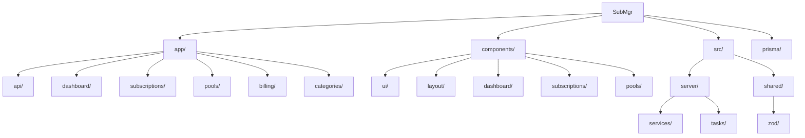

# SubMgr - 订阅管理系统

## 项目愿景

SubMgr 是一个个人订阅管理系统，帮助用户追踪和管理各类订阅服务（如流媒体、软件、会员等），支持拼车分摊功能，自动计算下次扣费日期并生成账单。

## 架构总览

- **技术栈**: Next.js 16 (App Router) + React 19 + TypeScript + Prisma + SQLite + Tailwind CSS + Shadcn UI
- **包管理**: pnpm
- **数据库**: SQLite (通过 better-sqlite3 适配器)

### 分层架构

```
app/           -> Next.js 路由层（页面 + API Routes）
components/    -> 可复用 UI 组件（Shadcn UI 基础组件 + 业务组件）
src/server/    -> 服务层（数据库操作、定时任务、HTTP 工具）
src/shared/    -> 纯业务逻辑（金额计算、日期处理、分摊算法、Zod schema）
lib/           -> 通用工具函数
prisma/        -> 数据库 schema 与迁移
```

### 依赖方向

- `app/*` -> `components/*`, `src/shared/*`, `src/server/*`
- `components/*` -> `src/shared/*`, `lib/*`
- `src/server/*` -> `src/shared/*`, `prisma`
- `src/shared/*` -> 不依赖其他层（保持纯净可测试）

## 模块结构图



## 模块索引

| 模块路径 | 职责 | 入口文件 |
|---------|------|---------|
| `app/` | Next.js 路由层，页面与 API | `layout.tsx` |
| `components/` | UI 组件库 | - |
| `src/server/` | 服务层、数据库操作、定时任务 | `db.ts`, `http.ts` |
| `src/shared/` | 纯业务逻辑、Zod schema | `split.ts`, `dates.ts`, `money.ts` |
| `prisma/` | 数据库 schema | `schema.prisma` |

## 数据模型

核心实体关系：

- **User** - 用户（MVP 阶段使用默认用户）
- **Category** - 订阅分类
- **Subscription** - 订阅记录（核心实体）
- **Pool** - 拼车组（关联订阅）
- **PoolMember** - 拼车成员
- **SubscriptionCharge** - 扣费记录
- **PoolPeriod** - 拼车账期
- **PoolLine** - 成员分摊明细

## 运行与开发

```bash
# 安装依赖
pnpm install

# 开发模式
pnpm dev

# 构建
pnpm build

# 启动生产服务
pnpm start

# 代码检查
pnpm lint
```

### 数据库

```bash
# 生成 Prisma Client
npx prisma generate

# 执行迁移
npx prisma migrate dev

# 查看数据库
npx prisma studio
```

## API 路由

| 路径 | 方法 | 说明 |
|-----|------|-----|
| `/api/subscriptions` | GET, POST | 订阅列表/创建 |
| `/api/subscriptions/[id]` | GET, PATCH, DELETE | 订阅详情/更新/删除 |
| `/api/categories` | GET, POST | 分类列表/创建 |
| `/api/categories/[id]` | GET, PATCH, DELETE | 分类详情/更新/删除 |
| `/api/pools` | GET, POST | 拼车组列表/创建 |
| `/api/pools/[id]` | GET, PATCH, DELETE | 拼车组详情/更新/删除 |
| `/api/pools/[id]/members` | POST, PATCH, DELETE | 成员管理 |
| `/api/charges` | GET, POST | 扣费记录 |
| `/api/charges/[id]` | GET, PATCH | 扣费详情/状态更新 |
| `/api/tasks/daily` | POST | 每日定时任务 |

## 测试策略

当前项目暂无测试文件。建议优先为以下模块添加单元测试：

- `src/shared/split.ts` - 分摊算法（核心业务逻辑）
- `src/shared/dates.ts` - 日期计算
- `src/shared/money.ts` - 金额处理

## 编码规范

- 使用 TypeScript 严格模式
- 使用 Zod 进行运行时类型校验
- API 路由使用 `apiHandler` 包装，统一错误处理
- 金额以最小单位（分）存储，避免浮点精度问题
- 组件使用 Shadcn UI 风格，样式使用 Tailwind CSS

## AI 使用指引

### 修改订阅相关功能

1. Schema 定义在 `src/shared/zod/subscription.ts`
2. 服务层在 `src/server/services/subscription.ts`
3. API 路由在 `app/api/subscriptions/`
4. 页面在 `app/subscriptions/`

### 修改拼车分摊功能

1. 分摊算法在 `src/shared/split.ts`
2. Pool schema 在 `src/shared/zod/pool.ts`
3. 服务层在 `src/server/services/pool.ts` 和 `charge.ts`

### 添加新的 API 路由

1. 在 `src/shared/zod/` 添加 Zod schema
2. 在 `src/server/services/` 添加服务函数
3. 在 `app/api/` 创建路由文件，使用 `apiHandler` 包装

## 变更记录 (Changelog)

- **2026-01-13**: 初始化 AI 上下文文档
